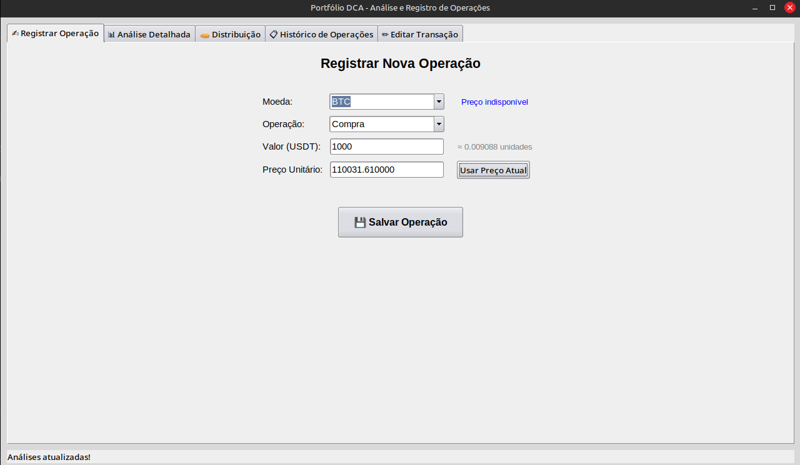

# 📊 Portfolio DCA Monitor

**Uma aplicação de desktop elegante e poderosa para acompanhar seu portfólio de criptomoedas, focada na estratégia DCA (Dollar-Cost Averaging), com cálculos precisos de preço médio, lucros e perdas.**


---

## Visão Geral

Este aplicativo foi criado para investidores de criptomoedas que buscam uma maneira simples e offline de gerenciar suas transações. Em vez de depender de planilhas complexas ou plataformas online, o Portfolio DCA Monitor salva seus dados localmente em um arquivo `CSV`, garantindo total privacidade e controle.

Ele busca preços em tempo real da Binance para fornecer uma análise precisa e atualizada do desempenho do seu portfólio.

## ✨ Funcionalidades Principais

*   **✍️ Registro de Transações:** Adicione operações de compra e venda de forma intuitiva.
*   **📊 Análise Detalhada:** Visualize seu preço médio (PMC), custo total da posição, valor de mercado atual, e lucros/perdas realizados e não realizados para cada ativo.
*   **💵 Conversão de Moeda:** Alterne a visualização de todos os valores monetários entre **USD** e **BRL** com um único clique.
*   **📉 Taxas Realistas:** Aplica uma taxa de negociação de **0.1%** em cada operação, simulando as condições de uma exchange real.
*   **🥧 Distribuição de Portfólio:** Entenda a alocação dos seus ativos com um resumo claro e uma representação visual em texto.
*   **📋 Histórico Completo:** Todas as suas transações são listadas e podem ser facilmente consultadas.
*   **✏️ Edição e Exclusão:** Corrija ou remova transações existentes diretamente pela interface.
*   **🔄 Preços em Tempo Real:** Conecta-se à API da Binance para buscar as cotações mais recentes das moedas e do par USDT/BRL.

## 🚀 Demonstração

Visão geral da interface, mostrando o registro de uma nova operação.



## 🛠️ Tecnologias Utilizadas

*   **Python 3**
*   **Tkinter** para a interface gráfica (GUI).
*   **ttkthemes** para modernizar o visual da aplicação.
*   **CCXT** para integração com a API da Binance e busca de preços.

## ⚙️ Instalação e Execução

Siga os passos abaixo para executar o projeto em sua máquina local.

### Pré-requisitos

*   [Python 3.10](https://www.python.org/downloads/) ou superior.

### Passos

1.  **Clone o repositório:**
    ```bash
    git clone https://github.com/BRUNO1993-CIBER/dca-desktop-monitor.git
    cd dca-desktop-monitor
    ```

2.  **Crie e ative um ambiente virtual (recomendado):**
    *   **Windows:**
        ```bash
        python -m venv venv
        .\venv\Scripts\activate
        ```
    *   **macOS / Linux:**
        ```bash
        python3 -m venv venv
        source venv/bin/activate
        ```

3.  **Instale as dependências:**
    ```bash
    pip install -r requirements.txt
    ```

4.  **Execute a aplicação:**
    ```bash
    python portfolio_dca.py
    ```
    Na primeira execução, um arquivo chamado `meu_diario_operacoes.csv` será criado automaticamente para armazenar suas transações.

## 📜 Licença

Este projeto está sob a licença MIT. Veja o arquivo [LICENSE](LICENSE) para mais detalhes.

---

*Feito com ❤️ por [Bruno Machado](https://github.com/BRUNO1993-CIBER)*
